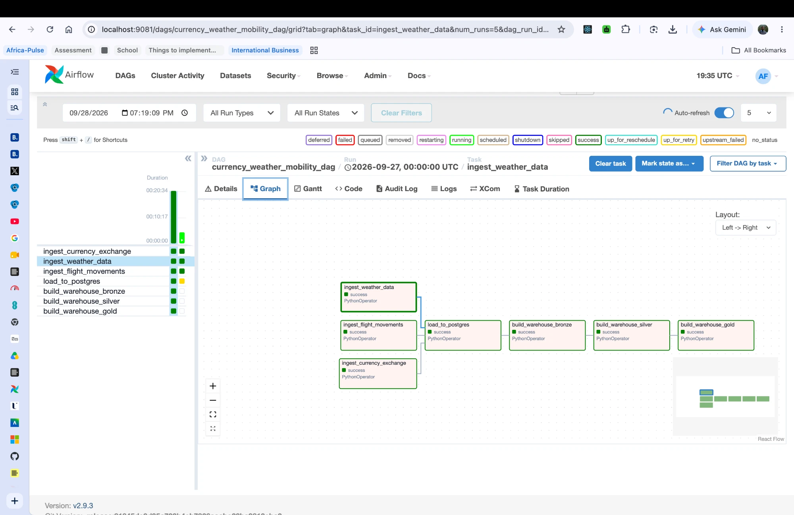

# Africa-Pulse

A daily Airflow pipeline that pulls weather, flight-mobility, and currency-exchange data for
three African cities, lands it in Postgres, and builds a bronze → silver → gold analytical
warehouse on top of it — ending in a city-level composite "livability" score.




## Prerequisites

- Docker and Docker Compose
- Accounts/keys for the three sources:
  - An [OpenSky Network](https://opensky-network.org/) account → OAuth2 client ID and secret
  - An [ExchangeRate-API](https://www.exchangerate-api.com/) key on a plan with the historical
    `history` endpoint (Pro, or the free trial)
  - A reachable Postgres database (this project uses ClickHouse Cloud's Managed Postgres) —
    host, port, database name, user, password
- Python 3.12+ and [uv](https://docs.astral.sh/uv/), only if you want to run pipeline code
  directly instead of through Airflow (e.g. `python -m pipeline.functions.load_db` for local
  testing)

## Running it

1. Copy `.env.example` to `.env` and fill in every value:

   ```bash
   cp .env.example .env
   ```

   | Variable | Used for |
   |---|---|
   | `OPENSKY_CLIENT_ID`, `OPENSKY_CLIENT_SECRET` | OpenSky OAuth2 |
   | `EXCHANGE_RATE_API_KEY` | ExchangeRate-API |
   | `POSTGRES_HOST`, `POSTGRES_PORT`, `POSTGRES_DB`, `POSTGRES_USER`, `POSTGRES_PASSWORD` | the `db_in_ch` Postgres database (bronze/silver/gold all live here) |
   | `_AIRFLOW_WWW_USER_USERNAME`, `_AIRFLOW_WWW_USER_PASSWORD` | the Airflow webserver's admin login |
   | `SIMULATE_LOAD_FAILURE` | optional, for testing failure handling |

2. Start everything:

   ```bash
   docker compose up
   ```

   `airflow-init` installs three packages the base Airflow image doesn't ship with
   (`openmeteo-requests`, `requests-cache`, `retry-requests`, via `_PIP_ADDITIONAL_REQUIREMENTS`
   in `docker-compose.yaml`) before starting, so the first run takes longer than a restart.

3. Open the Airflow UI at **http://localhost:9081** and log in with the admin credentials from
   `.env`.

4. Un-pause `currency_weather_mobility_dag` (DAGs start paused) and trigger a run, or wait for
   its daily schedule.

5. Once it succeeds, query `bronze`, `silver`, and `gold` directly against `db_in_ch` with any
   Postgres client, e.g.:

   ```sql
   SELECT * FROM gold.mart_city_intelligence ORDER BY date_key DESC, city_id;
   ```

### Running a single module locally (without Docker)

Each `pipeline.functions.*` module is runnable on its own — useful for testing one stage
without a full DAG run:

```bash
export PYTHONPATH=dags
export PIPELINE_DATA_DIR=./data   # required: no default outside the container
python -m pipeline.functions.load_db
python -m pipeline.functions.warehouse
python -m pipeline.functions.silver
python -m pipeline.functions.gold
```

`PIPELINE_DATA_DIR` has no safe default outside the container (it defaults to `/opt/airflow/data`,
which won't exist on your machine), so it must be set explicitly for a local run.

## Repository structure

```
dags/
  currency_weather_mobility_dags.py   the DAG: task wiring only, no business logic
  pipeline/
    paths.py                          shared file paths (PIPELINE_DATA_DIR-based)
    functions/
      token_manager.py                OpenSky OAuth2 token handling
      helpers.py                      Open-Meteo weather + air-quality ingestion
      opensky.py                      OpenSky flight-movement ingestion
      currency_exchange.py            ExchangeRate-API ingestion
      load_db.py                      upserts source CSVs into Postgres `public`
      warehouse.py                    builds the `bronze` schema
      silver.py                       builds the `silver` schema (validation + quarantine)
      gold.py                         builds the `gold` schema (star schema + marts)
docker-compose.yaml                   Airflow (LocalExecutor) + its own metadata Postgres
.env.example                          every required environment variable, undocumented values
```


## Cities and sources

| City | Country | Currency | Airport (ICAO) |
|---|---|---|---|
| Johannesburg | ZA | ZAR | FAOR |
| Cape Town | ZA | ZAR | FACT |
| Nairobi | KE | KES | HKJK |

| Domain | Source | Notes |
|---|---|---|
| Weather + air quality | [Open-Meteo](https://open-meteo.com/) | Free, no key |
| Flight mobility | [OpenSky Network](https://opensky-network.org/) | OAuth2 client credentials; daily arrivals/departures per airport |
| Currency exchange | [ExchangeRate-API](https://www.exchangerate-api.com/) | Pro plan (historical `history` endpoint); free 2-week trial |

## Architecture: medallion (bronze/silver/gold)

The pipeline is one Airflow DAG (`currency_weather_mobility_dag`), scheduled daily:

```
ingest_currency_exchange ┐
ingest_weather_data      ┼─▶ load_to_postgres ─▶ build_warehouse_bronze ─▶ build_warehouse_silver ─▶ build_warehouse_gold
ingest_flight_movements  ┘
```

- **Ingest (parallel):** each task fetches from its source and writes straight to a fixed-name
  CSV under `data/source/` in one step (no intermediate export task — see "Why one step per
  source" below).
- **`load_to_postgres`:** upserts the three CSVs into `public.{fx_rates,weather,mobility}` in
  Postgres (hosted as ClickHouse Cloud's Managed Postgres service, database `db_in_ch`).
- **`build_warehouse_bronze`:** copies `public.*` into a `bronze` schema, using the same
  natural-key upsert rules — `bronze` is deliberately a structural mirror of what was actually
  received, not yet cleaned.
- **`build_warehouse_silver`:** derives a conformed `dim_city` and validated versions of the
  three sources, quarantining rows that fail a hard rule into `silver.rejected_records` rather
  than discarding them.
- **`build_warehouse_gold`:** builds the star-schema dimensions, one fact table per domain, and
  four business-facing marts, including the City Intelligence composite score.

### Why medallion

- **Matches how the data actually degrades in quality**, source-shaped and unvalidated in
  bronze, cleaned and conformed in silver, business-shaped in gold — instead of trying to do
  cleaning, conforming, and aggregation in one pass.
- **Every layer is independently rebuildable.** Bronze, silver, and gold are each `TRUNCATE` +
  re-derive-from-the-layer-below on every run (not incremental appends), so a bug in the gold
  SQL can be fixed and gold can be rebuilt without re-ingesting from the APIs, and a bug in
  silver's validation rules can be fixed without re-copying bronze. Only bronze depends on an
  external source; every layer above it is pure SQL over the layer below.
- **Bronze is the evidence layer.** If a number in a mart looks wrong, it traces back through
  gold → silver → bronze → the original upserted row, without needing to re-fetch anything.
- **Failures are isolated per layer**, and per task in Airflow: if `build_warehouse_gold` fails,
  bronze and silver are already committed and don't need to re-run.

### Why one step per source (no separate export task)

Each `ingest_and_export_*` function fetches and writes its CSV in a single call, rather than
one Airflow task that fetches and a second that writes. Airflow's default XCom backend
serializes to JSON, so a task can't return a pandas DataFrame to a downstream task — the
`return_value` would fail to serialize. Splitting fetch and export into two tasks would need to
pass the DataFrame between them, which doesn't work. Each ingest task instead returns a small
JSON-safe summary, `{"rows": int, "watermark_date": "YYYY-MM-DD" | None}`, and the DAG pushes
`watermark_date` to its own XCom key so downstream tasks (or a future run) can see, without
re-reading the CSV, the latest date actually written — which can trail the requested date if a
source capped the range or partially failed.

## Gold layer design

### Star schema

- **`dim_city`** (a view over `silver.dim_city`) and **`dim_date`** (generated, covers
  2026–2027) are the conformed dimensions every fact and mart joins through.
- **One fact table per domain**, same grain as its silver source:
  `fact_weather_hourly` (city × hour), `fact_fx_rate_daily` (currency pair × day),
  `fact_flight_movement` (one flight movement).
- **Four marts**, aggregated to city × day:
  - `mart_climate_environment` — avg/min/max temperature, total precipitation, air-quality
    averages, plus `hours_missing` so a consumer can see data completeness instead of it being
    silently averaged away.
  - `mart_mobility` — arrivals, departures, total movements, plus `other_airport_missing_pct`,
    which carries forward OpenSky's real route-coverage gap instead of hiding it.
  - `mart_economic` — **grain is currency × day, not city × day.** ZAR is shared by
    Johannesburg and Cape Town; duplicating one real exchange rate as if it were two
    independent city-level measurements would misrepresent it. Consumers join to a city
    through `dim_city.currency`.
  - `mart_city_intelligence` — the composite score (below).

### Why a star schema on top of medallion

Silver is organized by *source* (one table per API). Gold reorganizes the same data by
*business meaning*: a shared city and date key across weather, mobility, and currency lets a
mart join all three domains without duplicating logic per query. This is what makes the
brief's "at least five analytical questions that require joining two or more domains" possible
without re-deriving conformed keys every time — the joins are just `USING (city_id, date_key)`.

### The City Intelligence score

Grain: city × day. Every score column is 0–100, higher = more livable.

| Component | Direction | Built from |
|---|---|---|
| Environment | lower CO₂ / dust / CO / precipitation = better | `mart_climate_environment`, 4 sub-measures min-max normalized then averaged |
| Mobility | higher total movements = better | `mart_mobility`, min-max normalized |
| Economic | lower `abs(day_change_pct)` = better | `mart_economic`, min-max normalized (a row with no prior day is excluded, not assumed stable) |

Design rules, chosen deliberately rather than left implicit:

- **Equal weighting (1/3 each).** No domain has more claim to importance than another without
  evidence otherwise.
- **Relative normalization.** Every raw measure is min-max normalized across this city set, not
  against an external reference (e.g. WHO air-quality bands). The score is therefore a
  comparison *within these three cities*, not an absolute standard — a stated limitation, not
  an oversight.
- **Missing domain → automatic reweighting.** If a city has no data in a domain for that day,
  that domain is dropped and the remaining domains' weights are rescaled — mathematically
  identical to "1/3 each, redistributed" since the weights are equal. Every row stores
  `n_components` and `components_used`, so this is visible, never silent.
- **No variance → neutral 50.0, not dropped.** If every usable value for a sub-measure happens
  to be identical (nothing to normalize against), that sub-measure scores a neutral midpoint —
  distinct from the value being genuinely missing, which stays excluded.
- **Temperature is deliberately excluded from the score.** Comfort is U-shaped (neither hot nor
  cold is inherently "better"), and expressing that needs an external reference point, which
  pure relative normalization doesn't have. `avg_temperature_c` is still in
  `mart_climate_environment` for context — it's just not scored.
- **Traceable, not a black box.** `mart_city_intelligence` stores the three normalized domain
  scores and the final score, not the raw measures again — a consumer traces a score back to
  its inputs with a two-column join to `mart_climate_environment` / `mart_mobility` /
  `mart_economic` on `(city_id, date_key)`.

The exact SQL, including the min/max-collision handling above, is in
[`dags/pipeline/functions/gold.py`](dags/pipeline/functions/gold.py).
